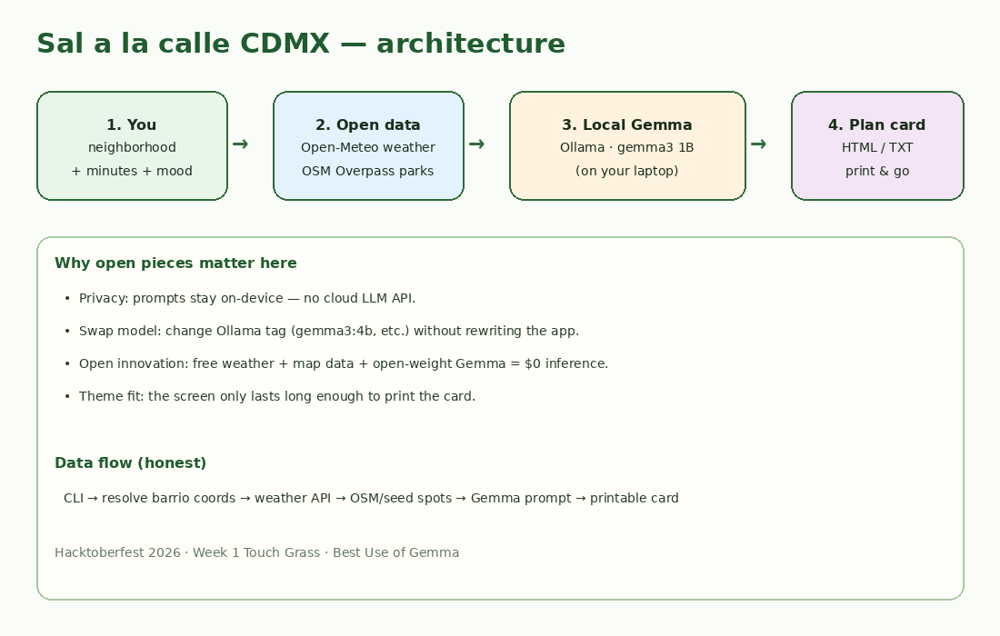
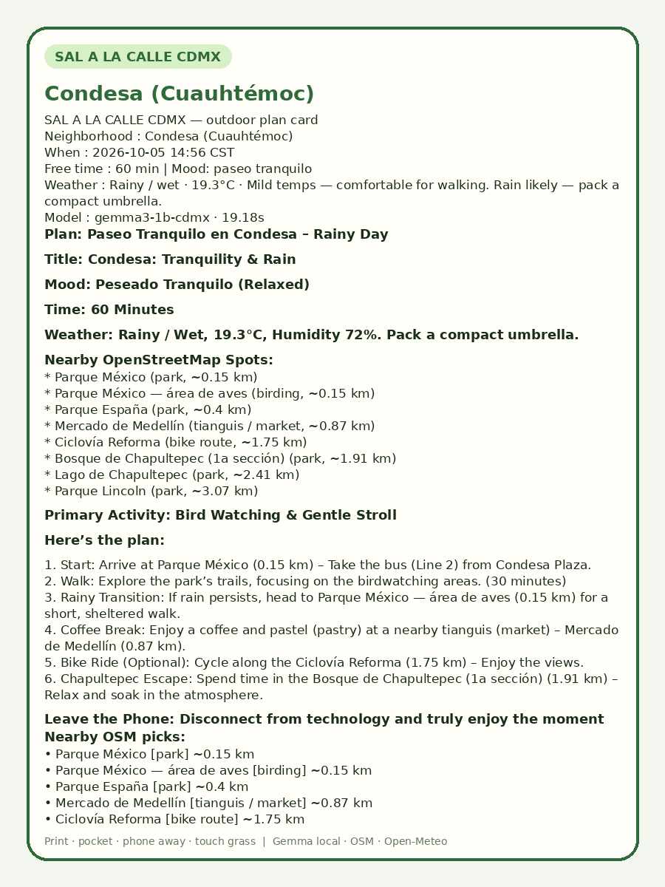
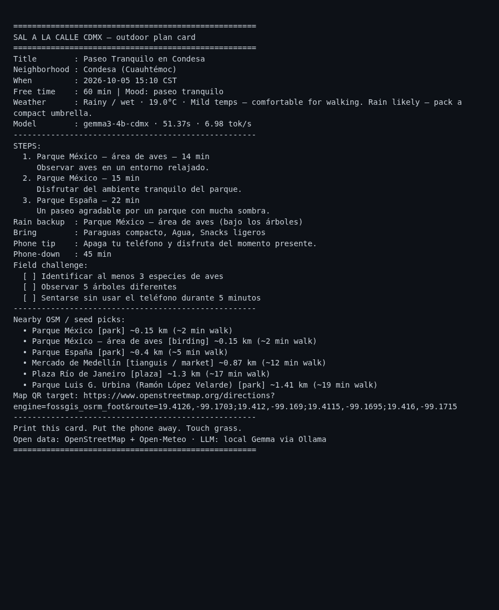

# Sal a la calle CDMX 🌿

**Touch grass with a one-page outdoor plan** — neighborhood + free time + mood → a printable card for Mexico City.

Built for [Hacktoberfest Open-Source AI Challenge: Week 1 — Touch Grass](https://dev.to/challenges/hacktoberfest-week1-2026-10-05) (Oct 5–11, 2026).

Open-weight **Gemma** (via [Ollama](https://ollama.com)) writes the plan locally. **OpenStreetMap** (Overpass) and **Open-Meteo** supply nearby parks/markets and weather. No cloud LLM. No API keys for the core path.



## Why this exists

CDMX is full of parks, tianguis, and birding corners — but when you finally have 45 free minutes, you usually open five apps and stay indoors. This tool makes the **screen the shortest part**: generate a card, print or screenshot it, put the phone away, walk outside.

## Features

- Built-in barrios: Condesa, Roma, Coyoacán, Centro, Chapultepec/Polanco, Santa Fe, Xochimilco, Tlalpan
- Live weather from Open-Meteo (no key)
- Nearby outdoor spots from OSM Overpass, with a curated CDMX seed fallback if the public Overpass instance is busy
- Local **Gemma 3 1B** (Q4) via Ollama — Spanish or English plans
- Outputs: `.txt` card, printable `.html`, and `.json` for reproducibility

## Quick start

### 1. Python

```bash
python3 -m venv .venv
source .venv/bin/activate
# No required pip packages for the core CLI (stdlib only).
```

### 2. Ollama + Gemma

```bash
# Install Ollama: https://ollama.com
ollama serve

# Option A — if `ollama pull` works on your network:
ollama pull gemma3:1b
ollama cp gemma3:1b gemma3-1b-cdmx   # optional alias

# Option B — create from a local GGUF (used during development):
# Download e.g. ggml-org/gemma-3-1b-it-GGUF → gemma-3-1b-it-Q4_K_M.gguf
# then:
cat > Modelfile <<'EOM'
FROM ./gemma-3-1b-it-Q4_K_M.gguf
PARAMETER temperature 0.7
PARAMETER num_ctx 2048
SYSTEM "You are a helpful outdoor guide for Mexico City (CDMX)."
EOM
ollama create gemma3-1b-cdmx -f Modelfile
```

Set `SALA_MODEL` if you use another tag (e.g. `gemma3:4b`).

### 3. Generate a plan

```bash
python -m src.main --list
python -m src.main -n condesa -m 60 --mood "paseo tranquilo" --lang es
python -m src.main -n chapultepec -m 45 --mood "easy bike ride" --lang en
```

Open the saved `samples/*.html` in a browser → print to PDF or screenshot → leave.

## Sample outputs

Real runs from 2026-10-05 (America/Mexico_City):

| Sample | Model time | Notes |
|--------|------------|-------|
| `samples/condesa_60m_paseo.*` | ~19 s | Rainy day, Parque México walk |
| `samples/coyoacan_90m_birding.*` | ~14 s | Birding + Viveros |
| `samples/chapultepec_45m_bike.*` | ~13 s | English bike plan |





## Project layout

```
src/
  main.py            CLI entry
  neighborhoods.py   barrio centroids
  weather.py         Open-Meteo
  osm.py             Overpass + CDMX seed fallback
  gemma.py           Ollama HTTP client
  render.py          TXT / HTML cards
samples/             real generated plans
images/              architecture + cards
```

## Honesty notes

- **Outdoor field test:** not claimed here. Leave your own story in the DEV post placeholder after you walk a plan.
- **LLM quirks:** Gemma 1B sometimes invents transit details (e.g. a bus line). Treat the plan as a friendly draft grounded in OSM/weather — verify before you go.
- **Overpass:** public instances can time out; the tool falls back to a curated seed of real CDMX places and labels the source.

## License

MIT — see [LICENSE](LICENSE).

Map data © OpenStreetMap contributors. Weather © Open-Meteo. Model: Google Gemma (open weights) via Ollama.
