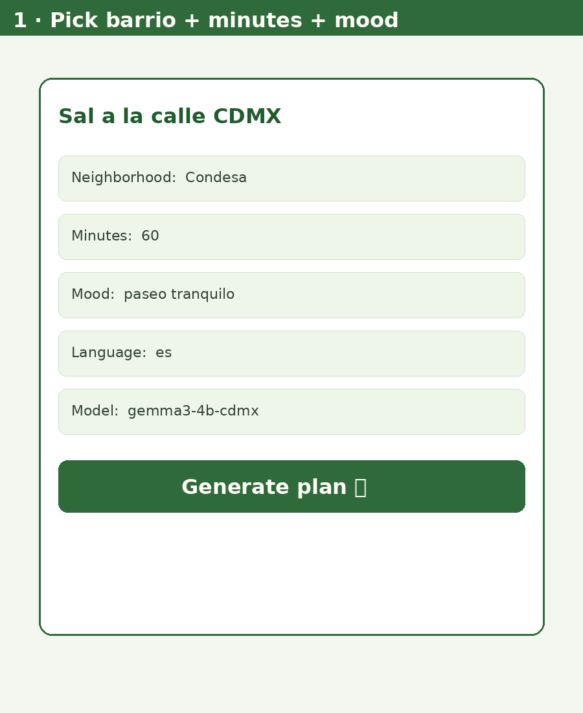

# Sal a la calle CDMX 🌿

**Touch grass with a one-page outdoor plan** — neighborhood + free time + mood → a printable card for Mexico City.

Built for [Hacktoberfest Open-Source AI Challenge: Week 1 — Touch Grass](https://dev.to/challenges/hacktoberfest-week1-2026-10-05) (Oct 5–11, 2026).

Open-weight **Gemma 3** (via [Ollama](https://ollama.com)) writes a **structured JSON** plan locally. **OpenStreetMap** / curated CDMX seeds and **Open-Meteo** ground it. A validator repairs bad places and times. The card includes a **QR walking map**, a tiny route sketch, an offline **field challenge**, and a **phone-down timer**. No cloud LLM. No API keys for the core path.


## Why this exists

CDMX is full of parks, tianguis, and birding corners — but when you finally have 45 free minutes, you usually open five apps and stay indoors. This tool makes the **screen the shortest part**: generate a card, print or screenshot it, put the phone away, walk outside.

## Features

- Built-in barrios: Condesa, Roma, Coyoacán, Centro, Chapultepec/Polanco, Santa Fe, Xochimilco, Tlalpan
- Live weather from Open-Meteo (no key) + **offline cache**
- Nearby outdoor spots from OSM Overpass, with a curated CDMX seed fallback
- Local **Gemma 3 4B** (default) or **1B** via Ollama — Spanish or English
- Structured JSON → validate/repair → printable HTML + PNG
- QR code to OpenStreetMap walking directions + tiny route SVG
- Offline field challenge checkboxes + phone-down timer suggestion
- CLI **and** Gradio web UI with Print button
- Optional `--offline` mode (seed places + cached weather + local model)

## Quick start

### 1. Python

```bash
python3 -m venv .venv
source .venv/bin/activate
pip install -r requirements.txt   # needed for Gradio UI / QR / PNG helpers
# Core CLI works with stdlib only if you skip PNG+QR extras.
```

### 2. Ollama + Gemma

```bash
# Install Ollama: https://ollama.com
ollama serve

# Option A — if `ollama pull` works:
ollama pull gemma3:4b
# or: ollama pull gemma3:1b

# Option B — create from a local GGUF (used during development when pull hit a CDN redirect):
# Download ggml-org/gemma-3-4b-it-GGUF → gemma-3-4b-it-Q4_K_M.gguf
ollama create gemma3-4b-cdmx -f Modelfile.example
```

Set `SALA_MODEL` (default `gemma3-4b-cdmx`). For the tiny model: `export SALA_MODEL=gemma3-1b-cdmx`.

### 3. Generate a plan (CLI)

```bash
python -m src.main --list
python -m src.main -n condesa -m 60 --mood "paseo tranquilo" --lang es
python -m src.main -n chapultepec -m 45 --mood "easy bike ride" --lang en
python -m src.main -n roma -m 50 --mood "tianguis" --lang es --offline
```

Open `samples/*.html` → **Print / PDF** → leave.

### 4. Gradio UI

```bash
python -m src.app
# open http://127.0.0.1:7860
```

## Sample outputs (real CPU runs, 2026-10-05, America/Mexico_City)

| Sample | Model | Wall time | tok/s |
|--------|-------|-----------|-------|
| `samples/condesa_60m_paseo.*` | gemma3-4b-cdmx | **51.4 s** | 7.0 |
| `samples/coyoacan_90m_birding.*` | gemma3-4b-cdmx | **34.3 s** | 9.9 |
| `samples/chapultepec_45m_bike.*` | gemma3-4b-cdmx | **35.8 s** | 10.2 |
| `samples/roma_50m_tianguis.*` | gemma3-4b-cdmx | **30.2 s** | 11.0 |
| `samples/compare/condesa_60m_paseo_1b.*` | gemma3-1b-cdmx | **21.8 s** | 33.4 |




## Project layout

```
src/
  main.py            CLI entry + plan pipeline
  app.py             Gradio UI
  neighborhoods.py   barrio centroids
  weather.py         Open-Meteo + offline cache
  osm.py             Overpass + CDMX seed fallback
  gemma.py           Ollama HTTP client (JSON format)
  plan.py            validate/repair, walk times, QR URL, SVG map
  render.py          TXT / HTML / PNG cards
samples/             real generated plans
images/              architecture, cards, demo GIF
data/                weather cache (created at runtime)
```

## Honesty notes

- **Outdoor field test:** not claimed in the repo. Leave your own story in the DEV post placeholder after you walk a plan.
- **1B vs 4B:** Gemma 3 1B is faster but often returns truncated / polluted JSON; the validator falls back to a safe grounded plan. Gemma 3 4B produces cleaner Spanish structured plans on this CPU (~7–11 tok/s).
- **Overpass:** public instances can time out; the tool falls back to a curated seed of real CDMX places and labels the source.
- **No model weights in git.** Download GGUFs yourself.

## License

MIT — see [LICENSE](LICENSE).

Map data © OpenStreetMap contributors. Weather © Open-Meteo. Model: Google Gemma (open weights) via Ollama.
